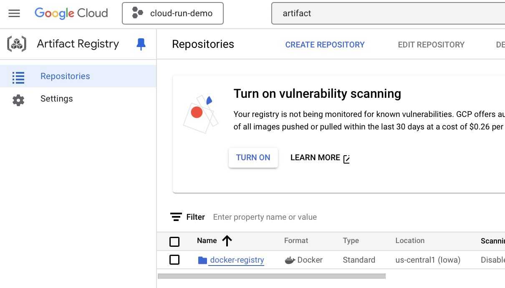

# Cloud Run with GitHub Actions

## Introduction

This guide provides a step-by-step walkthrough on setting up Google Cloud Run, and integrating it with GitHub Actions for deployment.
With Cloud Run, Google only charges you for compute when the container is doing work.
Cloud Run is quite unique, and has no direct equivalent on AWS and Azure.
(not for containers at least)

## GitHub.com

Please create a new repository on your GitHub account (e.g., 'my-blog').
This setup assumes that we are working with a private repo.
After this, proceed to Google Cloud.

## Google Cloud Run


Create a new project on Google Cloud with the [console](http://console.cloud.google.com).
(You probably need an active billing account to make this work.)
Please take note of the `$PROJECT_ID` and the `$PROJECT_NUMBER`.
After this, we will mostly use the shell to execute commands.

### Export variables

```bash
export PROJECT_ID="cloud-run-demo-456125"
export PROJECT_NUMBER="322545859129"
export GITHUB_REPO="lukeskywalker/my-blog"
export SERVICE_ACCOUNT="github-actions-service-account"
export WORKLOAD_IDENTITY_POOL="gh-pool"
export WORKLOAD_IDENTITY_PROVIDER="gh-provider"
```

In a shell, we can export these variables.
Please update at least the `PROJECT_ID`, `PROJECT_NUMBER`, and `GITHUB_REPO`.

### Set project

```bash
gcloud config set project $PROJECT_ID
```

This step ensures that we are making changes to the **correct** project.

### Enable apis

```bash
gcloud services enable \
   artifactregistry.googleapis.com \
   iamcredentials.googleapis.com \
   run.googleapis.com
```

If this is the first time that you run `gcloud` on your machine, then you probably will need to authenticate with Google.

### Create a service account

```bash
gcloud iam service-accounts create $SERVICE_ACCOUNT \
   --display-name="GitHub Actions Service Account"
```

A Service Account can temporarily assume roles.
We are setting up federated access for GitHub Actions here.
(This is really an elegant way to go about it because this does not use passwords or keys).

### Bind the SA to the Roles

```bash
gcloud projects add-iam-policy-binding $PROJECT_ID \
   --member="serviceAccount:$SERVICE_ACCOUNT@$PROJECT_ID.iam.gserviceaccount.com" \
   --role="roles/iam.serviceAccountUser"

gcloud projects add-iam-policy-binding $PROJECT_ID \
   --member="serviceAccount:$SERVICE_ACCOUNT@$PROJECT_ID.iam.gserviceaccount.com" \
   --role="roles/run.developer"

gcloud projects add-iam-policy-binding $PROJECT_ID \
   --member="serviceAccount:$SERVICE_ACCOUNT@$PROJECT_ID.iam.gserviceaccount.com" \
   --role="roles/artifactregistry.admin"

gcloud projects add-iam-policy-binding $PROJECT_ID \
   --member="serviceAccount:$SERVICE_ACCOUNT@$PROJECT_ID.iam.gserviceaccount.com" \
   --role="roles/storage.admin"
```

## Create a Workload Identity Pool for GitHub

This is the part where we actually set up Identity Federation.
Please make sure that you run the right commands here.
This part matters for security purposes.

### Create a pool

```bash
gcloud iam workload-identity-pools create $WORKLOAD_IDENTITY_POOL \
   --location="global" \
   --display-name="GitHub pool"
```

### Create workload provider

The attribute condition in the command above is the safety measure that we have in place.
It ensures that only requests from the correct GitHub username/repo can continue.

```bash
gcloud iam workload-identity-pools providers create-oidc $WORKLOAD_IDENTITY_PROVIDER \
   --location="global" \
   --workload-identity-pool="$WORKLOAD_IDENTITY_POOL" \
   --display-name="GitHub provider" \
   --attribute-mapping="google.subject=assertion.sub,attribute.actor=assertion.actor,attribute.repository=assertion.repository" \
   --attribute-condition="attribute.repository=='$GITHUB_REPO'" \
   --issuer-uri="https://token.actions.githubusercontent.com"
```

### Verify the result

We can go to the Console and verify that we just created a new provider named **gh-pool**.
To check this, click on **IAM & Admin** in your project, and then **Workload Identity Federation**.

You should see something similar to this:


(note that we have a provider with the ID `gh-pool`)

### Allow authentications from the Workload IdP

Allow by originating from your repository.

```bash
gcloud iam service-accounts add-iam-policy-binding \
   $SERVICE_ACCOUNT@$PROJECT_ID.iam.gserviceaccount.com \
   --role="roles/iam.workloadIdentityUser" \
   --member="principalSet://iam.googleapis.com/projects/$PROJECT_NUMBER/locations/global/workloadIdentityPools/$WORKLOAD_IDENTITY_POOL/attribute.repository/${GITHUB_REPO}"
```

(This policy binding also checks that the GitHub-repo is correct)

### Save this value

We need to store the `$WORKLOAD_IDENTITY_PROVIDER_LOCATION`.
It contains as string like

```bash
WORKLOAD_IDENTITY_PROVIDER_LOCATION=$(gcloud iam workload-identity-pools providers \
   describe $WORKLOAD_IDENTITY_PROVIDER \
   --location="global" \
   --workload-identity-pool=$WORKLOAD_IDENTITY_POOL \
   --format="value(name)")
```

The value this variable looks like this: `projects/322545859129/locations/global/workloadIdentityPools/gh-pool/providers/gh-provider`

## Artifact Registry

The previous guide makes use of the container registry.
However, Google [is dropping support for the container registry.](https://cloud.google.com/artifact-registry/docs/transition/transition-from-gcr)
Instead, we will be making an [Artifact Registry](https://cloud.google.com/artifact-registry/docs/overview).
(it's a bit fancier, but still does the same thing)

### Create the registry

```bash
gcloud artifacts repositories create docker-registry  \
      --repository-format=docker \
      --project=$PROJECT_ID \
      --location=us-central1 \
      --description="the docker registry" \
      --async \
      --disable-vulnerability-scanning
```

- If you set the `--immutable-tags` flag here you cannot push the same `image:tag` twice
- It's possible to go to the console, and check that we just created a registry.



## Update the GitHub Repo

Congrats! The most difficult part is done.
Now, we just need to copy and paste these scripts, and update some values.
With each pushed commit, we trigger a workflow.
This workflow builds a container, pushes it to the Artifact registry, and then deploys it.
(with Cloud Run)

### Create this structure

```bash
mkdir -p .github/workflows
touch .github/workflows/docker-build.yaml
touch Dockerfile
touch main.py
```

Now it should look similar to this:

```
🚀 $ tree -L 3 -a
.
├── .github
│   └── workflows
│       └── docker-build.yaml
├── Dockerfile
└── main.py
```

### Save important variables

We need to yank these and paste them into the GitHub Actions script:

```bash
echo "us-central1-docker.pkg.dev/$PROJECT_ID/docker-registry/app"
echo "$WORKLOAD_IDENTITY_PROVIDER_LOCATION"
echo "$SERVICE_ACCOUNT@$PROJECT_ID.iam.gserviceaccount.com"
```

Take note of:

```bash
image_name = ???
workload_identity_provider = ???
service_account = ???
```

### GitHub Actions Script

Please update the previously listed variables in the script below.

```yaml
# ----------------------------------------------------------------
# GitHub Actions Workflow for Google Cloud Run w/ Federated Access
# ----------------------------------------------------------------
# Description   : Build, deploy, then check the url
# File location : ./.github/workflows/docker-build.yaml
# ----------------------------------------------------------------
name: cloud-run
on:
  push:
    branches: [main]
  pull_request:
    branches: [main]
  workflow_dispatch: # enables manual deployment
jobs:
  deploy:
    runs-on: ubuntu-latest
    permissions:
      contents: "read"    # required to checkout the repository
      id-token: "write"   # required for google cloud authentication
    env:
      #                                       <--CHANGE-->
      # format:    <region>                   <project-id>         /<repo-name>     /<image-name>
      IMAGE_NAME: "us-central1-docker.pkg.dev/cloud-run-demo-4xxxxx/docker-registry/app"
    steps:
      # 1) this step checks out your repository under $github_workspace
      - name: "checkout repository"
        uses: actions/checkout@v2
      # 2) this step authenticates with google cloud using workload identity federation
      - name: "authenticate to google cloud"
        uses: google-github-actions/auth@v2
        with:
          #                                     <--CHANGE-->
          workload_identity_provider: "projects/3225458xxxxx/locations/global/workloadIdentityPools/gh-pool/providers/gh-provider"
          # The service account to impersonate -- << THIS WILL CHANGE WITH EACH NEW PROJECT >>
          service_account: "github-actions-service-account@cloud-run-demo-4xxxxx.iam.gserviceaccount.com"
      # 3) this step configures docker to use google cloud credentials
      - name: "configure docker"
        run: gcloud auth configure-docker us-central1-docker.pkg.dev,asia-northcentral1-docker.pkg.dev
      # 4) this step builds the docker image using the dockerfile in the repository
      - name: "build docker image"
        run: docker build . -t $IMAGE_NAME
      # 5) this step pushes the built image to google cloud's artifact registry
      - name: "push docker image"
        run: docker push $IMAGE_NAME
      # 6) this step deploys the container to cloud run
      - name: "deploy docker image"
        id: deploy
        uses: "google-github-actions/deploy-cloudrun@v2"
        with:
          image: ${{ env.IMAGE_NAME }}  # The image to deploy
          region: us-central1           # The region to deploy to
          service: app                  # The name of the Cloud Run service
          flags: --port=8000            # Additional deployment flags
      # 7) this step tests the deployed service by making a request to its url
      - name: "test url"
        run: curl "${{ steps.deploy.outputs.url }}"
```

### Simple Webserver

```python
# ----------------------------------------------------------
# Script for Simple Webserver
# ---------------------------------------------------------
# Description   : Runs a simple server without dependencies
# File location : ./main.py
# ---------------------------------------------------------

import http.server
import socketserver

PORT = 8000

class MyHandler(http.server.SimpleHTTPRequestHandler):
    def do_GET(self):
        if self.path == "/":
            self.send_response(200)
            self.send_header("Content-type", "text/plain")
            self.end_headers()
            self.wfile.write(b"Hello, World!")
        else:
            super().do_GET()  # Fallback for other paths

def run():
    with socketserver.TCPServer(("", PORT), MyHandler) as httpd:
        print(f"Serving on port {PORT}")
        httpd.serve_forever()

if __name__ == "__main__":
    run()

```

### Dockerfile

```Dockerfile
# ----------------------------------------------------------
# Dockerfile for Simple Web Server
# ---------------------------------------------------------
# Description   : A simple Python web application container
# File location : ./Dockerfile
# ---------------------------------------------------------

FROM python:3.12-alpine
WORKDIR /app
COPY main.py /app
EXPOSE 8000
CMD ["python", "main.py"]
```

## Check that Cloud Run can Deploy


(fingers crossed it is all green)

## Enable access in the console


By default, Google Cloud Run does not allow unauthenticated users to visit this address.
We can change this with a setting in the Cloud Console.

## References

- Deploy Docker images on Google Cloud Run using GitHub Actions and Workload Identity Authentication, ([Leandro Toledo, 2022](https://blog.leandrotoledo.org/deploying-google-cloud-run-using-github-actions-and-workload-identity-authentication/))
- GCloud workload-identity-pools providers create-oidc INVALID_ARGUMENT error #139154, ([Sam Nash, 2024](https://github.com/orgs/community/discussions/139154))
